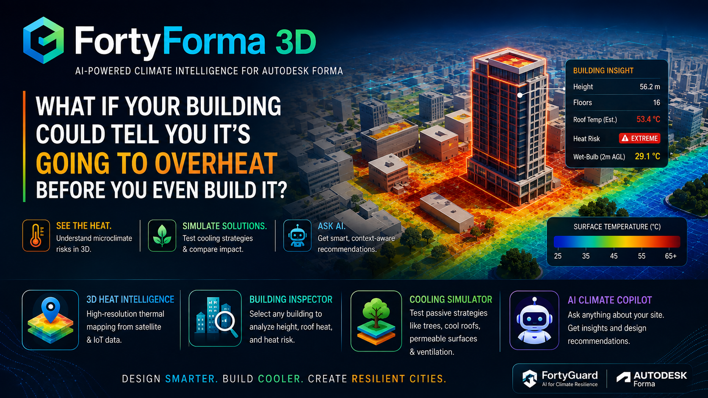
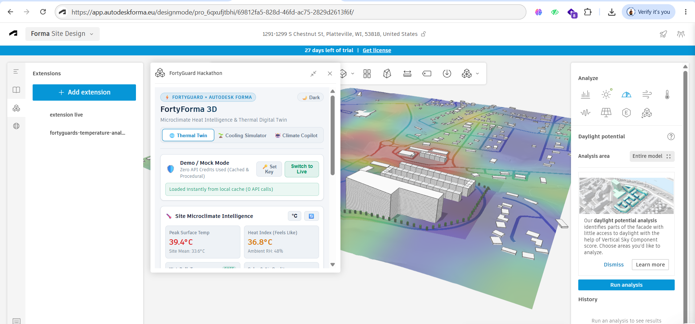

# ⚡ FortyForma 3D
### Microclimate Heat Intelligence & Thermal Digital Twin for Autodesk Forma

[](https://fortyguard.com)
[](https://aps.autodesk.com/en/docs/forma/v1/embedded-views/introduction/)
[](https://aps-forma-extension-shadow-study.vercel.app)
[](https://youtu.be/AXHmg-9oo78)

> **Live Vercel Extension URL**: [https://aps-forma-extension-shadow-study.vercel.app](https://aps-forma-extension-shadow-study.vercel.app)  
> **Video Walkthrough**: [https://youtu.be/AXHmg-9oo78](https://youtu.be/AXHmg-9oo78)  
> **Local Dev Port**: `http://localhost:8081`  
> **Primary Track**: **Track 1 — Resilient Cities & Infrastructure (Digital Twin)**  
> **Cross-Track Synergies**: **Track 2 (Future Buildings & Energy Payback)** • **Track 6 (Agentic AI Copilot)**  
> **Foundation**: Built upon the official **Autodesk Forma Embedded View Extension Starter** (`aps-forma-extension-shadow-study`) and upgraded into a complete microclimate intelligence suite with FortyGuard.

---



---

## 🎥 Video Walkthrough

Watch the complete video demonstration of **FortyForma 3D** running live inside Autodesk Forma:

[](https://youtu.be/AXHmg-9oo78)

🔗 **Direct Video Link**: [https://youtu.be/AXHmg-9oo78](https://youtu.be/AXHmg-9oo78)

---

## 🌍 Executive Summary & Problem Statement

**80% of urban heat vulnerability is locked into buildings during the early massing and master-planning phase.** Historically, architects and urban planners have designed structures in 3D BIM tools (like Autodesk Forma) without real-time microclimate intelligence, resulting in severe urban heat island (UHI) effects, dangerous pedestrian heat stress, and massive HVAC cooling loads.

**FortyForma 3D** bridges **FortyGuard's satellite and IoT thermal canopy models (TCM)** directly into **Autodesk Forma's 3D design canvas**. In real-time, architects can:
1. **Visualize 3D Surface Heatmaps**: Project high-resolution FortyGuard thermal ground and roof textures across 100% of the terrain with scientific color palettes (*Turbo*, *Plasma*, *Temperature*).
2. **1-Click 3D Building & Roof Heat Inspection**: Select any building mass in the 3D scene to calculate its true height ($Z$), floor count, projected roof skin temperature, and localized 2m wet-bulb safety limits.
3. **Simulate Passive Heat Mitigation**: Interactively toggle high-albedo cool roofs (SRI > 82), vegetative tree canopy buffers, and permeable paving to de-risk urban heat, simulate multi-degree surface temperature reductions, and lower building cooling energy demand.
4. **Consult an AI Climate Copilot**: Query live AI reasoning (powered by **Groq / Llama 3.1 & 3.3**, **Google Gemini**, or **OpenAI**) enriched with live FortyGuard spatial microclimate telemetry.

---

## 📸 Extension Visual Tour & Screenshots

| Module | Feature Preview |
| :--- | :--- |
| **Tab 1: 🌐 Thermal Twin**<br>Full 3D terrain ground texture projection, Heat Index, and 2m OSHA Wet-Bulb Safety |  |
| **Tab 1: 🏢 3D Building Inspector**<br>1-click building height ($Z$) & floor count detection with tailored roof mitigation |  |
| **Tab 2: 🌱 Cooling Simulator**<br>Interactive passive mitigation modeling, cool roofs, tree canopy greening, and energy savings |  |
| **Tab 3: 🤖 Climate Copilot**<br>Live AI reasoning with dynamic Groq / Gemini models and FortyGuard context |  |

---

## 🚀 How to Add FortyForma to Autodesk Forma (Step-by-Step)

You can load FortyForma into your active Autodesk Forma design workspace in under 30 seconds:

```
┌────────────────────────────────────────────────────────────────────────┐
│                        Autodesk Forma Web Canvas                       │
│                                                                        │
│  1. Open your project at https://app.autodeskforma.eu                  │
│  2. Click the "Extensions" icon in the left/top navigation menu        │
│  3. Click "+ Add Extension by URL"                                     │
│  4. Paste Extension URL:                                               │
│     https://aps-forma-extension-shadow-study.vercel.app                │
│     (or http://localhost:8081 for local development)                  │
│  5. Click "Save & Open"                                                │
│                                                                        │
│  ⚡ FortyForma 3D will appear in your Right-Hand Side Analysis Panel!  │
└────────────────────────────────────────────────────────────────────────┘
```

---

## 🗂️ Core Architecture & Feature Breakdown

FortyForma 3D is structured into 3 purpose-built microclimate intelligence modules:

### Tab 1: 🌐 Thermal Twin (Diagnosis & 3D Spatial Analytics)
* **Full-Coverage Ground Texture Projection**: Uses bilinear offscreen canvas interpolation to map FortyGuard TCM polygons across 100% of Forma's terrain bounding box.
* **3 Scientific Palettes**: *Turbo* (multi-color high-contrast), *Plasma* (perceptually uniform purple-to-yellow), and *Temperature* (blue-to-red thermal gradient).
* **1-Click 3D Building Inspector**: Subscribes to `Forma.selection.subscribe`, extracts $(X, Y, Z)$ mesh triangles, computes building height in meters and floor count, and predicts roof surface heat dynamics.
* **2D Ground Parcel Drawing**: Lets users draw custom polygons for plazas, street corridors, and courtyards with landscape-specific interventions (tree buffers, permeable pavers, bioswales).
* **Human Safety Layer**: Calculates localized **Heat Index ("Feels Like")** and **Stull's Wet-Bulb Equation** ($T_{wb}$) with OSHA safety badges (*Safe*, *Caution*, *Extreme Danger*).
* **Mode Switcher**: Toggle between zero-credit Demo/Mock Mode and Live FortyGuard API with browser-safe API key storage.

### Tab 2: 🌱 Cooling Simulator (Passive Mitigation & ROI)
* **Side-by-Side Impact Comparison**: Compares unmitigated site baseline against active mitigation scenarios.
* **Executive Impact KPI Banner**: Highlights modeled peak surface temperature reductions and HVAC cooling load savings.
* **Interactive Strategy Cards**:
  - 🏠 **High-Albedo Cool Roofs (SRI > 82)**: Lowers upper-floor roof skin heat and solar absorption.
  - 🌳 **Deciduous Tree Canopy Buffering**: Provides solar shading and evapotranspirative cooling along pedestrian walkways.
  - 🧱 **Permeable Ground Pavers**: Replaces impervious asphalt to improve moisture retention and evaporative cooling.
  - 💨 **Ground Cross-Ventilation Breezeways**: Enhances natural air circulation aligned with prevailing summer wind corridors.

### Tab 3: 🤖 Climate Copilot (AI-Driven AEC Advisory)
* **Multi-Provider Live LLM Support**: Connects directly to **Groq** (`llama-3.1-8b-instant`, `llama-3.3-70b-versatile`), **Google Gemini** (`gemini-1.5-flash`), or **OpenAI** (`gpt-4o-mini`).
* **Dynamic Model Discovery**: Queries Groq `/v1/models` in real time to lock onto active accounts without configuration errors.
* **Telemetry-Enriched System Prompt**: Feeds active FortyGuard site baseline, coolest/hottest spatial sectors, solar irradiance ($W/m^2$), 2m wet-bulb ($^\circ\text{C}$), and inspected building dimensions into the LLM context.
* **1-Click Built-in Fallback**: Fast rule-based response engine with 0 latency and instant 1-click fallback buttons if API keys are not configured.

---

## ⚡ FortyGuard API Integration Points

FortyForma communicates with the FortyGuard Large Temperature Model (LTM) API suite:

| Endpoint | Parameter Payload | Output Used in FortyForma |
| :--- | :--- | :--- |
| `POST /v1/heatmap` | `analytic_type: "tcm"`, `granularity: 60`, `polygon_aoi` | Polygon GeoJSON temperature cells projected onto Forma 3D terrain ground texture. |
| `POST /v1/env_params` | `latitude`, `longitude`, `date_time` | 2m Pedestrian AGL ambient temperature, relative humidity, solar irradiance, AQI, and wet-bulb safety. |
| `GET /v1/status/{id}` | `activity_id` polling | Async task resolution engine with automatic cache serialization. |

---

## 💻 Tech Stack & Developer Setup

* **Foundation**: Official Autodesk Forma Embedded View Extension Starter (`aps-forma-extension-shadow-study`)
* **Framework**: Preact 10 + TypeScript 5 (ultra-lightweight bundle <160 kB gzipped)
* **Bundler & Proxy**: Vite 5 with CORS-free `/api/fortyguard`, `/api/groq`, `/api/openai`, `/api/gemini` proxy handlers
* **3D Integration**: Autodesk Forma Embedded View SDK (`forma-embedded-view-sdk` v0.87+)
* **Design System**: FortyGuard Clean White Theme (Default) with CSS token architecture & `☀️ Light / 🌙 Dark` mode toggle.

### Running Locally:
```bash
# 1. Clone repo & navigate to extension
git clone <repo-url>
cd aps-forma-extension-shadow-study

# 2. Install dependencies
npm install

# 3. Start development server on port 8081
npm run dev

# 4. In Autodesk Forma: Add Extension -> http://localhost:8081
```

### Production Build:
```bash
npm run build
```

---

## 👥 Hackathon Team & Acknowledgements

* **Hackathon**: FortyGuard Global AI Hackathon 2026
* **Primary Track**: Track 1 — Resilient Cities & Infrastructure
* **Submission Date**: August 2026
* **Team**: Team Berlin (FortyForma 3D)
